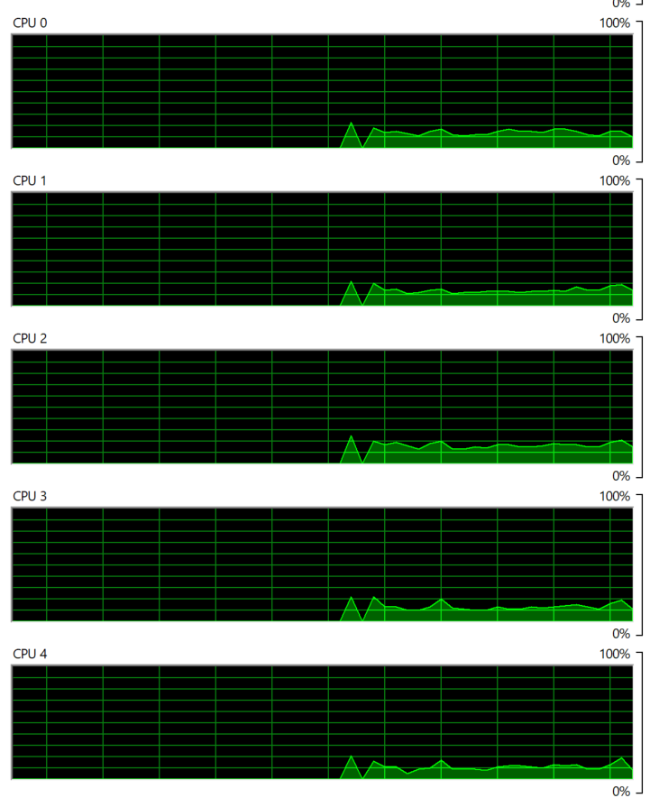

## Methodology

### Purpose
The purpose of this project is to analyze the impact of varying the number of threads on the execution time of matrix multiplication tasks. By leveraging multi-threading, we aim to parallelize matrix multiplication operations and observe how the performance scales with the number of threads.

### Data Generation
1. **Random Matrix Generation**: Generate 100 random matrices of size 1000x1000 using NumPy.
2. **Constant Matrix**: Generate a constant matrix of size 1000x1000 for multiplication with the random matrices.

### Multi-Threading Implementation
1. **Thread Management**: Utilize the Python `threading` module to manage concurrent execution of matrix multiplication tasks.
2. **Limiting Active Threads**: Implement logic to limit the number of active threads running simultaneously to prevent resource exhaustion.
3. **Matrix Multiplication**: Each thread performs matrix multiplication of a single random matrix with the constant matrix.

### Experimentation
1. **Iterative Testing**: Conduct multiple experiments, varying the number of threads from 1 to 15.
2. **Measurement**: Record the execution time for each experiment.
3. **Statistical Analysis**: Analyze the collected data to observe trends and patterns in execution time as the number of threads increases.
### Result
| No. of Threads | 1   | 2   | 3   | 4   | 5   | 6   | 7   | 8   | 9   | 10  | 11  | 12  | 13  | 14  | 15  |
|----------------|-----|-----|-----|-----|-----|-----|-----|-----|-----|-----|-----|-----|-----|-----|-----|
| Time (seconds) | 100.7888 | 51.1994 | 35.939 | 31.1437 | 23.2135 | 18.0904 | 15.3677 | 13.3793 | 11.0482 | 14.3701 | 10.4843 | 9.1431 | 8.137 | 8.3911 | 14.5163 |

### Visualization

### Resource monitor

   

